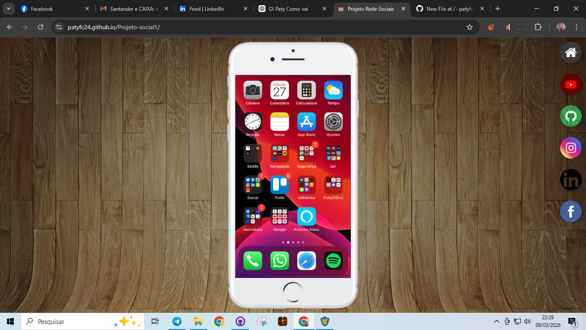

## 📸 Preview do projeto

📱 Projeto Social
📖 Sobre o projeto

Este projeto consiste em uma interface interativa que simula o uso de redes sociais dentro de um smartphone, desenvolvida durante meus estudos de HTML e CSS.

A aplicação apresenta um layout que representa um celular na tela, onde é possível navegar entre diferentes páginas de redes sociais através de ícones laterais. O conteúdo é carregado dinamicamente dentro da tela do celular utilizando iframes, criando uma experiência semelhante a um aplicativo mobile.

🎯 Objetivo

O objetivo deste projeto foi praticar conceitos importantes do desenvolvimento web, como:

Estruturação de páginas com HTML5

Estilização de layout com CSS3

Navegação entre páginas

Uso de iframes

Organização visual de interfaces

🛠 Tecnologias utilizadas

HTML5

CSS3

Git

GitHub

GitHub Pages

🌐 Acesse o projeto

🔗 https://patyfc24.github.io/Projeto-social1/

📚 Aprendizados

Durante o desenvolvimento deste projeto, pratiquei:

Criação de interfaces simulando dispositivos móveis

Navegação entre páginas HTML

Estrutura de layout utilizando CSS

Publicação de projetos utilizando GitHub Pages

👩‍💻 Autora

Projeto desenvolvido por Patricia Felicio durante meus estudos de desenvolvimento web.
